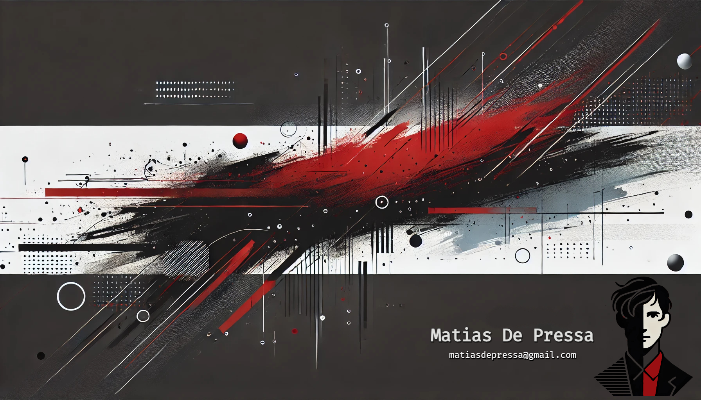

  <h1 align="center">👋 Hi, everyone 👋</h1> 

## ⚙️ Skills:

 Python development
 
 
 Web development
 
 
📱 Mobile development
 
 
🎮 Video-Game development
 
 
👨‍🏫 Educational aptitude

## 👨‍💻 About Me:
My name is Matías De Pressa, and I am a programming student who also teaches Python courses. I've been involved in this "World" for three years, and I deeply enjoy all the time I've spent studying, practicing, working, and teaching programming.
I have experience in various programming languages such as Java, JavaScript, C++, C#, PHP, Python, etc. I have also worked with HTML, CSS, database engines like MySQL or SQLite, and some frameworks.  
I received recognition in the category of Originality and Innovation at the 20th Edition of the "Expo Proyecto" held by the Universidad Nacional de la Matanza (UNLAM), in Buenos Aires, Argentina; for the proyect: CODEX.  
Additionally, I have experience in video game development using Unity. As proof, there is the video game [*Oneiro Man*](https://store.steampowered.com/app/3146700/Oneiro_Man/?l=latam) on steam, developed by IZI Studios, where I am an active member of the team.

##  GitHub Analitics:
 

          
